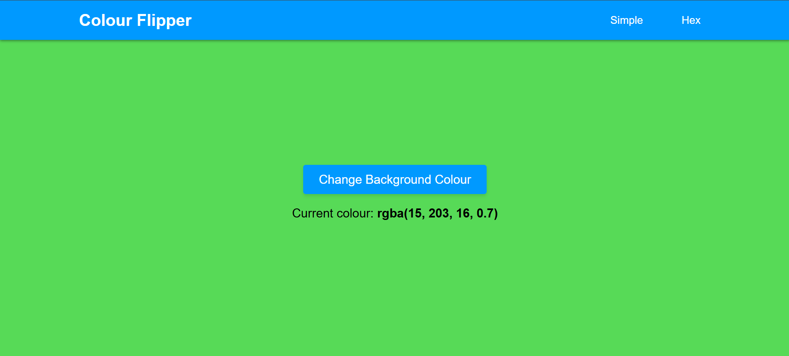
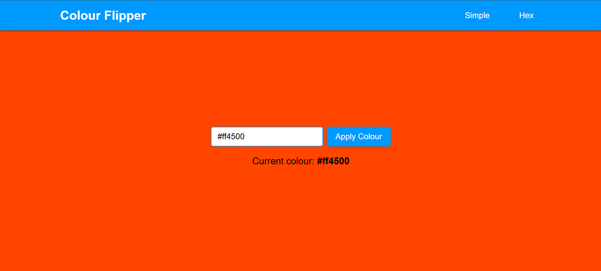

# Colour Flipper

A simple web app that allows you to change the background color of your page with a **click** or **by typing a Hex code**.

## Features
- **Simple Mode**: Click a button to randomly change the background color.
- **Hex Mode**: Type in a Hex color code to change the background color.
- **Smooth Transition**: Color changes with smooth fade-in effects.

## Screenshots

### Simple Mode

### Hex Mode

## Technologies Used
- **HTML**: Structure of the web page.
- **CSS**: Styling of the page and transitions.
- **JavaScript**: Color-changing functionality.

